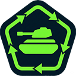

# Tanki Online — Combos & QoL

<div align="center">
  

  **Quality-of-life browser extension for Tanki Online**

  [](manifest.json)
  [](manifest.json)

</div>

---

## 📋 Table of Contents

- [Overview](#-overview)
- [Features](#-features)
- [Installation](#-installation)
- [Usage](#-usage)
- [Privacy & permissions](#-privacy--permissions)
- [Architecture](#-architecture)
- [Project structure](#-project-structure)
- [Development](#-development)
- [Contributing](#-contributing)

---

## 🎯 Overview

A single extension with the tools that make Tanki Online less tedious, added
directly into the game's own interface:

- **Combo manager** — save a full garage setup and equip it again in one click,
  instead of walking through every tab and menu.
- **Battle chat translation** — read foreign chat in your own language, in place
  on the game screen.

Both are built to look and feel native: the UI mirrors the game's own colors,
fonts, and hover states rather than announcing itself as a third-party addition.

---

## ✨ Features

### ⚙️ Combo manager

- **Save your current setup** — scans and stores your whole configuration.
- **Equip in one click** — the extension navigates the tabs and equips each piece
  for you.
- **Full equipment coverage:**

  | Category | Notes |
  | --- | --- |
  | **Turrets** | includes augment support |
  | **Hulls** | includes augment support |
  | **Drones** | handles name variations |
  | **Grenades** | — |
  | **Protection** | all 4 slots, with resistance-type detection |
  | **Augments** | tracked separately per turret/hull |

- **Combo cards** with item preview images; drag and drop to reorder; rename
  inline; delete with confirmation.
- **Per-item skip** — mark a single slot as "removed" so a combo only changes part
  of your setup.
- **"Include protections" toggle** — when off, equipping a combo leaves your
  current protections untouched (their icons dim on the cards to show they're
  skipped).
- **Randomizer** — pick a random saved combo, or roll a fully random setup from
  the items you own.
- **Import / export** — move your combos between browsers or back them up.
- **Quick access** — a "COMBOS" tab in the garage menu, a button in the lobby, and
  the `C` key shortcut.
- **Follows the game's language** and only ever equips items you actually own.

### 💬 Battle chat translation

- **Instant, then translated** — the original message is drawn immediately (so
  chat never lags), with a small spinner, then swaps to the translation.
- **Source language shown** — e.g. `[RU] » nice shot`, so you always know what was
  translated.
- **20 target languages**, picked from a native-styled dropdown injected into the
  game's own Settings screen.
- **Slang stays slang** — `gg`, `ez`, `noob`, `hahaha` and friends are shown
  verbatim and never sent anywhere.
- **Toggle any time** — a button next to the chat bar, or `Alt+T`, flips the whole
  chat between original and translated. The setting persists.
- **Fully optional** — turn translation off in the game's Settings screen and the
  combo manager keeps working exactly as before.

---

## 🚀 Installation

### From the Chrome Web Store

**[➜ Install from the Chrome Web Store](https://chromewebstore.google.com/detail/tanki-online-combo-manage/aodkeckgccekmgmeddikfjgfnomalacm)**

> **Updating from an older version?** This release adds the chat-translation
> feature, which needs permission to reach the translation service. Chrome
> handles new permissions by disabling the extension until you approve them — if
> the extension seems to have stopped working after an update, click the
> extensions (puzzle 🧩) icon in your toolbar and accept the new permission. It
> only happens once.

### Load unpacked (development)

1. Clone the repository:
   ```bash
   git clone https://github.com/IsraBA/TankiCombosQoL.git
   ```
2. Open `chrome://extensions/` and enable **Developer mode**.
3. Click **Load unpacked** and select the project folder.
4. Open [Tanki Online](https://tankionline.com), log in, and enter the garage —
   you should see a new **COMBOS** tab.

Requires Chrome, Edge, or another Chromium-based browser.

---

## 📖 Usage

### Saving your first combo

1. Equip the setup you want in the garage.
2. Open the **COMBOS** tab (or press `C` in the lobby).
3. Click **Save Current Combo** — a card appears with your equipment.
4. Click the combo's name to rename it (e.g. "Sniper Setup") and press Enter.

### Loading a combo

Open the **COMBOS** tab, find the combo, and click **Equip**. The extension
navigates the equipment tabs, equips each item, applies augments and protection
modules, and returns to the Protection tab when it's done.

### Managing combos

- **Reorder** — drag a card to a new position.
- **Delete** — click the × on the card and confirm.
- **Skip one item** — click the × on an individual item image; it will be left
  untouched when the combo is equipped.

### Using chat translation

It is on by default. Enter a battle and foreign messages will translate
themselves. To configure it, open the game's **Settings** screen and scroll to the
**Chat Translator** section, where you can turn it off or change your language.
In battle, the button next to the chat bar (or `Alt+T`) switches between the
original text and the translation.

### Keyboard shortcuts

| Key | Action | Context |
| --- | --- | --- |
| `C` | Open the combo manager | Lobby / garage |
| `Alt+T` | Toggle original ↔ translated chat | In battle |

### Tips

- Create combos per game mode (TDM, CTF, CP) and give them clear names.
- Put your most-used combos at the top.
- Re-save a combo after upgrading equipment so it stays current.

---

## 🔒 Privacy & permissions

Short version: **your combos never leave your browser. The only thing that is ever
sent anywhere is the text of a chat message you asked to have translated.**

| Permission | Why it's needed |
| --- | --- |
| `storage` | saves your combos and settings locally |
| `*://*.tankionline.com/*` | the game page — read equipped items, inject the UI, locate the chat UI |
| `translate.googleapis.com`, `lingva.lunar.icu`, `lingva.ml` | send message text to be translated |

- Combos, names, order and settings are stored with the browser's extension
  storage. They are never transmitted.
- When translation is enabled, the **text of a chat message** is sent to Google
  Translate (with Lingva as a fallback) to get the translation back. Only the text
  and your target language are sent — no username, no sender identity, no other
  metadata. Nothing is sent while translation is off, and slang-only messages are
  never sent at all.
- There is no server of our own, no account, no analytics, no tracking, and no
  chat history stored anywhere.

Full details: [docs/PRIVACY.md](docs/PRIVACY.md).

This extension is an independent tool and is not affiliated with or endorsed by
Tanki Online or its publisher.

---

## 🏗️ Architecture

Vanilla JavaScript, Manifest V3, no build step and no external libraries. Each
feature is self-contained under `features/`; only UI components are shared.

```
┌────────────────────── ISOLATED world ──────────────────────┐
│  features/combos/        main.js → MutationObserver         │
│    lib → core → ui       DOM scanning + equipping           │
│                                                             │
│  features/translator/isolated/    chrome.* access:          │
│    bridge.js   settings sync + translate relay              │
│    detect.js   parses the game bundle for the chat HUD      │
└──────────────────────────┬──────────────────────────────────┘
                           │ window.postMessage bridge
┌──────────────────────────┴───── MAIN world ─────────────────┐
│  features/translator/main/   shares the page's window        │
│    chat.js      captures the chat HUD, rewrites messages     │
│    translate.js request + cache + timeout                    │
│    toggle.js / gamesettings.js   in-game UI                  │
└──────────────────────────┬──────────────────────────────────┘
                           │ chrome.runtime.sendMessage
┌──────────────────────────┴──────────────────────────────────┐
│  background.js (service worker)                              │
│    the only context allowed the cross-origin fetch           │
│    Google Translate → Lingva fallback                        │
└──────────────────────────────────────────────────────────────┘
```

Why three contexts: content scripts run in an isolated world by default, which is
fine for DOM work, but capturing the game's chat HUD needs a hook on the page's own
`Object.prototype` (MAIN world only), and in MV3 a content-script `fetch` is bound
by the page's CORS policy — so the translation request has to happen in the
service worker.

`shared/components/` holds the native-styled `switch`, `select` and `drawer`
components. Because JS worlds don't share a `window`, the component files are
listed in both worlds' content-script blocks; each world gets its own copy on
`window.TankiQoL`.

---

## 📂 Project structure

```
.
├── manifest.json              # 4 content-script blocks (CSS / translator ×2 / combos)
├── background.js              # service worker — translation fetch
├── shared/components/         # switch, select, drawer (used by both features)
├── features/
│   ├── combos/
│   │   ├── main.js            # orchestrator
│   │   ├── lib/               # constants (DOM selectors), utils, language_manager
│   │   ├── core/              # saver, loader, navigators, scanners/, equippers/, randomizer/
│   │   └── ui/                # menu + lobby injectors, renderers, drag, modals, drawers
│   └── translator/
│       ├── isolated/          # bridge.js, detect.js
│       ├── main/              # chat.js, translate.js, settings.js, skiplist.js, toggle.js, gamesettings.js
│       └── assets/flags/      # language flags
├── assets/icons/              # extension icons
├── docs/                      # PRIVACY.md, STORE.md, PACKAGING.md
├── build/make-zip.ps1         # builds the Chrome Web Store zip
├── HTML-examples/             # captured game HTML/CSS, used as styling reference
└── CLAUDE.md                  # full developer/agent guide — start here
```

**Design rules** (the long version lives in [CLAUDE.md](CLAUDE.md)):

- Scanners only read, equippers only write, navigators only move.
- All game DOM selectors live in one file (`features/combos/lib/constants.js`).
- Never use the game's generated CSS class names (`ksc-*`) — they change every
  build. Extension classes are prefixed `cme_`.
- Wait on the DOM with MutationObservers, not fixed timeouts.
- The script order in `manifest.json` is a dependency chain — don't reorder it.

---

## 💻 Development

```bash
git clone https://github.com/IsraBA/TankiCombosQoL.git
```

Then load the folder unpacked (see [Installation](#-installation)). There is no
build step — edit a file, hit the reload icon on the extension card in
`chrome://extensions`, and refresh the game tab.

**Debugging.** Open DevTools on the game page. Combos logs appear as
`[ComboManager]` lines. The translator runs in the page world and exposes
`__CT_STATE()`, `__CT_DEBUG` and `__CT_MSGS` in the page console. Full debugging
and recovery notes — including what to do when a Tanki update breaks chat
detection — are in [CLAUDE.md](CLAUDE.md).

**Packaging for the store.** Run `build/make-zip.ps1`. It packs only what should
ship and refuses to build if internal docs slip in; see
[docs/PACKAGING.md](docs/PACKAGING.md).

**Testing** is manual. Before submitting a change, walk the checklist in
CLAUDE.md → "Testing": both features, and at least one non-English game locale if
you touched UI or selectors.

### Common issues

| Symptom | Likely cause |
| --- | --- |
| COMBOS tab missing | game UI changed — update selectors in `features/combos/lib/constants.js` |
| Items not equipping | name cleaning in `utils.js`, or ownership detection |
| Clicks not registering | timing — adjust the waits in the equippers/navigators |
| Chat not translating | bundle detection broke after a game update — see CLAUDE.md → "When a Tanki build breaks the translator" |

---

## 🤝 Contributing

Fork, branch, make your change, run the manual test pass, then open a PR. Match
the existing code style: IIFE modules on the `window.TankiQoL` namespace, Hebrew
comments, no external dependencies.

---

### Version history

**v3.0** — Added battle chat translation (previously a separate extension) and
renamed to "Combos & QoL". Restructured into `features/` + `shared/`.

**v2.5** — "Include protections" toggle when equipping.

**v2.0** — Full rewrite: modular layout, automatic tab navigation, protection (4
slots) and augment support, drag-and-drop reorder, lobby button and `C` shortcut,
multi-language, per-item removal.

**v1.0** — Basic save/load, manual tab switching, limited equipment.

---

[Issues](https://github.com/IsraBA/TankiCombosQoL/issues)
